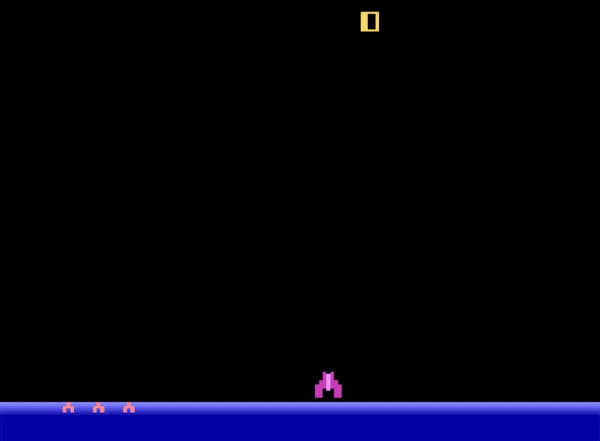

# DQN Atari Project

This repository contains an implementation of the Deep Q-Network (DQN) architecture described in the breakthrough paper by Mnih et al., "Playing Atari with Deep Reinforcement Learning" (2013). The project replicates the DQN architecture and training from scratch using PyTorch, Gymnasium, and NumPy.

## Overview

This project implements the Deep Q-Learning algorithm to play Atari games through reinforcement learning. The implementation follows the architecture described in the original DeepMind paper, but achieves significant results with approximately 1/150th of the original training time.



## Project Structure

```
dqn-atari/
├── src/                 # Package containing all relevant classes and functions
├── training.py          # Script for training the model
├── eval.py              # Script for evaluating the trained model
├── model/               # Saved model weights
├── plots/               # Training and evaluation plots
├── vid/                 # Recorded gameplay videos
│   ├── gameplay.gif     # Animated GIF of gameplay
│   └── rl-video-episode-0.mp4  # Demo video of the trained agent
├── Pipfile              # Pipenv dependencies file
├── Pipfile.lock         # Pipenv lock file
├── report.pdf           # Detailed project report
└── README.md            # This file
```

## Requirements

This project uses `pipenv` for dependency management. Make sure you have `pipenv` installed on your system.

```bash
pip install pipenv
```

## Setup and Installation

1. Clone the repository:
   ```bash
   git clone https://github.com/username/dqn-atari.git
   cd dqn-atari
   ```

2. Set up the virtual environment and install dependencies:
   ```bash
   pipenv install
   ```
   This will install all necessary dependencies from the Pipfile.lock.

3. Activate the virtual environment:
   ```bash
   pipenv shell
   ```

## Training the Model

To train the model from scratch:

```bash
python training.py
```

This script will:
- Initialize the DQN architecture
- Train the agent using the specified Atari environment
- Save the trained CNN model in the `model/` directory
- Generate training plots in the `plots/` directory

## Evaluating the Model

To evaluate a trained model:

```bash
python eval.py
```

This script will:
- Load the trained model
- Run evaluation episodes (set render = "human" to display the live full quality render)
- Save evaluation frames, plots, and gameplay videos
- The evaluation videos will be saved in the `vid/` directory

## Results

Despite training for only about 1/150th of the time used in the original paper, our model demonstrates substantial understanding of the game dynamics. The agent learns effective strategies and achieves relatively good performance.

Check out the gameplay demonstration video at `vid/rl-video-episode-0.mp4` to see the trained agent in action.

## Detailed Report

A comprehensive report on the implementation, training process, and results is available in the repository as `report.pdf`.

## Citation

This project is based on:

Mnih, V., Kavukcuoglu, K., Silver, D., Graves, A., Antonoglou, I., Wierstra, D., & Riedmiller, M. (2013). Playing Atari with Deep Reinforcement Learning. DeepMind Technologies. arXiv:1312.5602 [cs.LG].

## Conclusion

This implementation demonstrates that even with significantly reduced training time compared to the original paper, the DQN architecture can learn meaningful policies for Atari games. The model shows a substantial understanding of game dynamics and develops effective strategies, highlighting the efficiency of the approach when implemented with modern deep learning frameworks.
